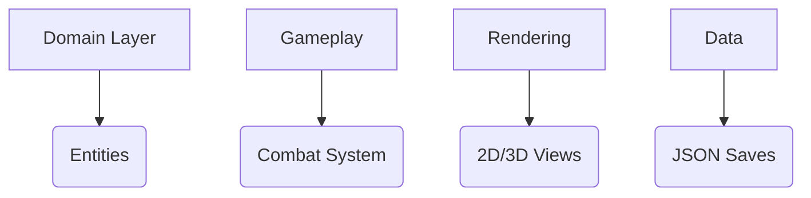

# Rogue-like Dungeon Crawler

[](https://www.python.org/)
[](https://docs.python.org/3/library/curses.html)

Terminal-based dungeon crawler with procedural generation and entity-component-system architecture.


```bash
git clone https://github.com/GrabCrabD/rogue.git
cd rogue
python3.10 main.py
# Follow menu help
```

main menu:


## Key Mechanics

- 21 procedurally generated levels
- 5 enemy types with unique AI
- Inventory management system
- Fog of war implementation
- Dynamic difficulty adjustment
- Ray-casting 3D mode

## Core Architecture



[Explore Rogue (1980) Gameplay and Enemy Mechanics](https://en.wikipedia.org/wiki/Rogue_(video_game)).

